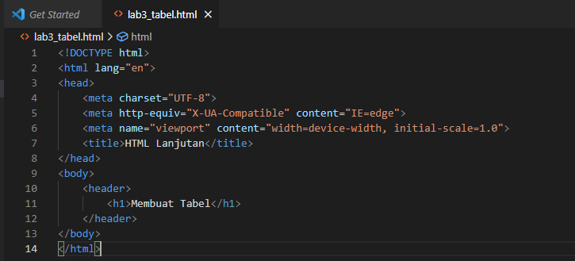

### HTML Lanjutan
## Membuat list

Buat file HTML dengan nama lab3_list.html kemudian tulis tag dasar HTML seperti dibawah.

List terbagi kedalam 3 bagian, yakni ordered list, unordered list dan description list.

# Membuat ordered list

Pertama beri judul dengan menggunakan tag `<h2>`. Untuk membuat ordered list menggunakan tag `<ol>`, di dalam tag `<ol>` ada tag `<li>` agar ada nomornya. Dan ordered list ini di bungkus oleh tag `<section>` yang di beri ID agar mudah di berikan style CSS.

Dan ordered list ini di simpan di tag `<body>` seperti gambar berikut.

Kemudian ini tampilannya di browser.

# Membuat unordered list

Untuk membuat unordered list menggunakan tag `<ul>` yang diberi ***type="square"*** agar yang tadinya angka akan berubah jadi kotak. Di dalam tag `<ul>` ada tag `<li>`, dan unordered list ini di bungkus oleh tag `<section>` yang di beri ID agar mudah di berikan style CSS dan diberi judul dengan tag `<h2>`. Penempatannya juga di simpan di tag `<body>`.

Ini tampilannya di browser.

# Membuat description list

Untuk membuat description list menggunakan tag `<dl>`, di dalamnya ada tag `<dt>` dan tag `<dd>`. Untuk tag `<dd>` tulisan akan otomatis bergeser ke kanan, sehingga tag `<dt>` menjadi sebuah judul dari tag `<dd>`. dan description list ini di bungkus oleh tag `<section>` yang di beri ID agar mudah di berikan style CSS dan diberi judul dengan tag `<h2>`. Penempatannya juga di simpan di tag `<body>`.

Dan ini tampilannya di browser.

## Membuat tabel

Buat file HTML dengan nama lab3_tabel.html kemudian tulis tag dasar HTML seperti dibawah.

Kemudian untuk membuat tabel menggunakan tag `<table>` yang di dalamnya di tambahkan ***border*** untuk mengatur tebal tabel, dan ***cellpadding*** untuk memberi jarak antara border dengan content/bacaan dalam sel. 

Tabel mempunyai head dan body, untuk head menggunakan tag `<thead>` dan untuk body menggunakan tag `<tbody>`.  Di dalam tag `<thead>` terdapat tag `<tr>` yang merupakan tag untuk membuat tabel kolom secara horizontal, dan di dalam tag `<tr>` terdapat tag `<th>` untuk mengisikan data atau judul dari masing masing kolom.

Kemudian body menggunakan tag `<tbody>` yang di dalamnya ada tag `<tr` dan di dalam tag `<tr` ada tag `<td>`, dimana tag `<td>` fungsinya sama dengan tag `<th>`.
Untuk tag `<tr` yang pertama merupakan baris kedua,  tag `<tr` yang kedua merupakan baris ketiga dan seterusnya. Contohnya seperti gambar dibawah.

Ini tampilannya di browser.

Agar tampilan tabelnya lebih bagus lagi, tambahkan ***cellspacing="0"*** pada tag `<table>` seperti gambar di bawah.

Ini tampilannya di browser.

Jadi spasi antar selnya hilang karena  ***cellspacing="0"***.

# Menggabungkan Sel Data

Untuk menggabungkan sel data, gunakan atribut rowspan dan colspan. Atribut rowspan untuk 
menggabungkan baris (secara vertikal) dan colspan untuk menggabungkan kolom (secara 
horizontal). Di dalam tag `<table>` tambahkan ***border="1" cellpadding="6" cellspacing="0"***. Untuk tag `<tr>` pertama pada tag `<tbody>`, tag `<td>` yang kedua tambahkan atribut ***rowspan="3"***. Perhatikan gambar di bawah.

Ini tampilannya di browser.

## Membuat form

Buat file HTML dengan nama lab3_form.html kemudian tulis tag dasar HTML seperti dibawah.

Untuk membuat form menggunakan tag `<form>` kemudian tambahkan atribut ***action="proses.php" method="post"***, maksud dari  atribut ***action="proses.php"*** adalah data yang akan di proses di ambil dari file proses.php dengan ***method="post"*** adalah metode pengiriman data yang terpisah dengan url.

Untuk menambahkan garis yang berbentuk kotak gunakan tag `<fieldset>` dan gunakan tag `<legend>` untuk memberi nama form tersebut. 

Untuk setiap elemen di bungkus dengan tag `
`.

1. Tag `
` yang pertama berisi tag `<label>` dengan isi ***nama***, dan berisi tag `<input>` dengan ***type="text"***. 

2. Tag `
` yang kedua berisi tag `<label>` dengan nama ***alamat***, dan berisi tag `<textarea>`.

3. Tag `
` yang ketiga berisi tag `<label>` dengan nama ***jenis kelamin***, dan berisi dua tag `<input>` dengan ***type="radio"***. 

4. Tag `
` yang keempat berisi tag `<input>` dengan ***type="submit" value="login"***.

Perhatikan gambar di bawah.

Ini tampilannya di browser.

# Menabahkan Style pada Form

Agar tampilannya lebih cantik tambahkan deklarasi CSS menggunakan tag `<style>` yang di simpan pada tag `<head>`.

Ini tampilannya di browser.

## Pertanyaan dan Tugas
1. Buatlah form yang menampilkan dropdown menu dan listbox dengan multiple selection.

Ini tampilannya di browser.

